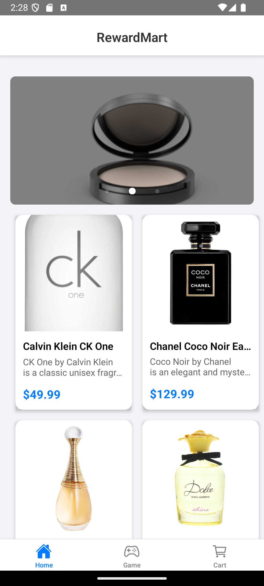
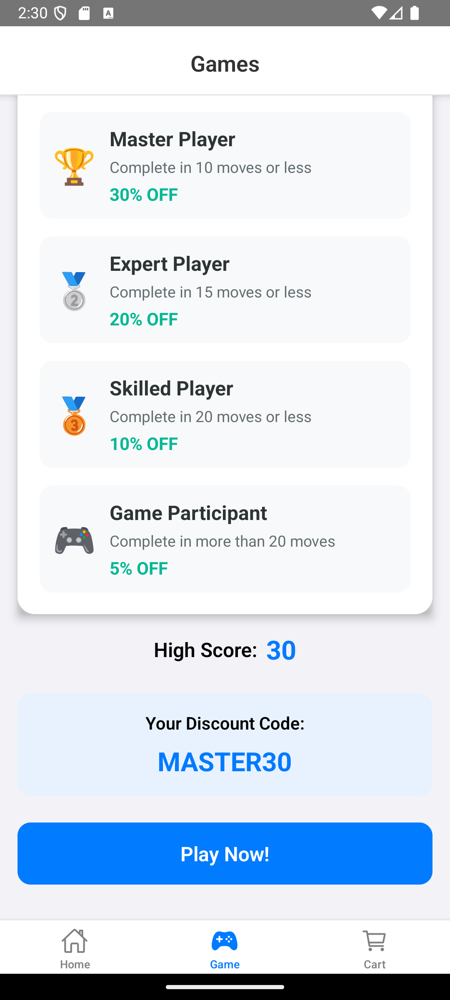
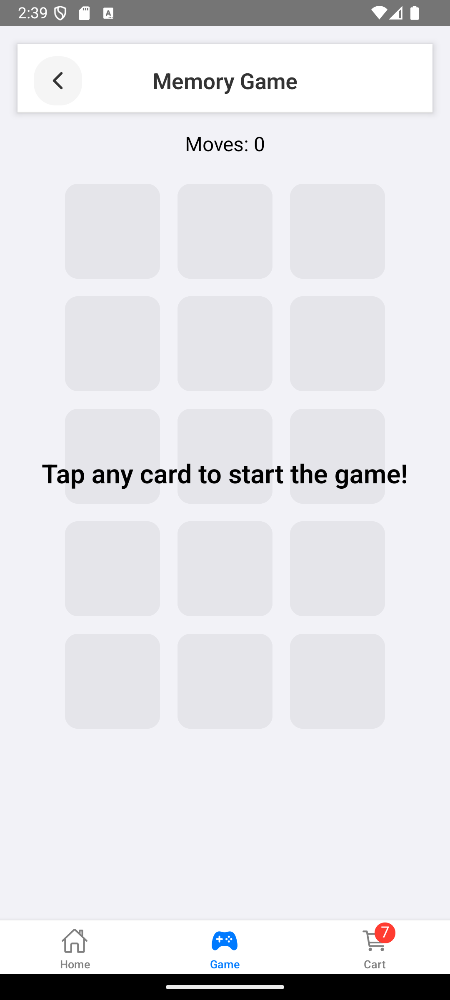
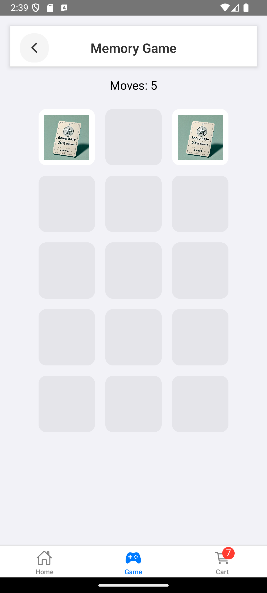
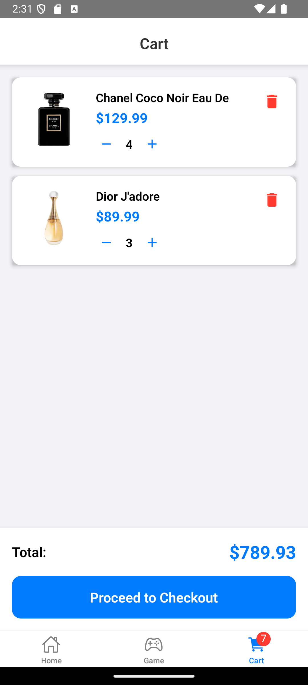

# RewardMart - React Native E-commerce App with Interactive Game

A modern e-commerce mobile application built with React Native, featuring an engaging interactive memory game that rewards users with promotional discounts.

## Screenshots

<div style="display: flex; flex-wrap: wrap; gap: 10px; justify-content: center;">









</div>

## Features

### Core Features

- Home Screen with banner slider and product listings
- Detailed product pages with image carousel
- Shopping cart functionality
- Interactive Memory Game
  - Card-matching gameplay with discount rewards
  - Performance-based discount system (5-30% off)
  - Real-time score tracking
  - Animated card flips and transitions
- Bottom tab navigation
- State management using Redux
- Mock API integration using json-server

### Memory Game Feature

#### Game Mechanics
- 🎮 Interactive card-matching memory game
- 🔄 Players flip cards to find matching pairs
- 📊 Score tracking based on number of moves
- ✨ Smooth card flip animations with React Native Animated
- 🎯 Progress tracking with move counter
- 🏆 Achievement system with different reward tiers

#### Reward System
Based on the number of moves to complete the game:

| Rank | Moves | Discount | Code |
|------|-------|-----------|------|
| 🏆 Master | ≤ 10 | 30% OFF | MASTER30 |
| 🥈 Expert | ≤ 15 | 20% OFF | GREAT20 |
| 🥉 Skilled | ≤ 20 | 10% OFF | GOOD10 |
| 🎮 Player | > 20 | 5% OFF | TRY5 |

#### Technical Implementation
- Built using React Native's Animated API for smooth transitions
- Redux integration for state management
- Persistent high score tracking
- Discount code generation and storage
- Responsive design for various screen sizes

## Prerequisites

- Node.js >= 14
- npm or yarn
- React Native CLI
- Android Studio (for Android development)
- Xcode (for iOS development)
- CocoaPods (for iOS dependencies)
- json-server (for mock API)


## Server Setup

1. Install json-server globally:
```bash
npm install -g json-server
```

2. Start the mock API server:
```bash
npm run server
```
3. If Axios network error -> Open a new terminal and run the following command:
```bash
adb reverse tcp:3000 tcp:3000
```

This will start json-server on:
- Host: 0.0.0.0 (accessible from Android emulator and physical devices)
- Port: 3000
- Database: db.json

### Accessing the API

- From Android Emulator: `http://10.0.2.2:3000`
- From iOS Simulator: `http://localhost:3000`
- From Physical Device: `http://<your-computer-ip>:3000`

### Available Endpoints

- Products: `GET /products`
- Banners: `GET /banners`

### Sample Data

The server uses `db.json` which includes:
- Product catalog with images and details
- Banner carousel data

## Setup Instructions

1. Clone the repository:

```bash
git clone https://github.com/nnrohu/RewardMart.git
cd RewardMart
```

2. Install dependencies:

```bash
npm install
# or
yarn install
```

3. Install iOS dependencies:

```bash
cd ios
pod install
cd ..
```

4. Start the mock API server:

```bash
npm run start-server
# or
yarn start-server
```

5. Run the application:

For iOS:

```bash
npm run ios
# or
yarn ios
```

For Android:

```bash
npm run android
# or
yarn android
```

## Project Structure

```
src/
├── assets/         # Images, fonts, and other static assets
├── components/     # Reusable components
├── navigation/     # Navigation configuration
├── screens/        # Screen components
├── store/         # Redux store configuration and slices
├── services/      # API services
├── game/          # Interactive game components
├── App.tsx         # Main entry point
└── index.js        # Entry point for the app
```

## Technologies Used

### Frontend
- ⚛️ React Native
- 🔄 Redux Toolkit for state management
- 🧭 React Navigation for routing
- 📝 TypeScript for type safety
- 🎨 Custom animations with React Native Animated
- 💅 Custom styled components

### Backend & Data
- 🔄 Axios for API requests
- 📄 json-server for mock API
- 📦 Local storage for game progress

### Development
- 📱 React Native CLI
- 🛠️ TypeScript
- 📦 npm for package management

## Contributing

1. Fork the repository
2. Create your feature branch (`git checkout -b feature/amazing-feature`)
3. Commit your changes (`git commit -m 'Add some amazing feature'`)
4. Push to the branch (`git push origin feature/amazing-feature`)
5. Open a Pull Request

## License

This project is licensed under the MIT License - see the LICENSE file for details
